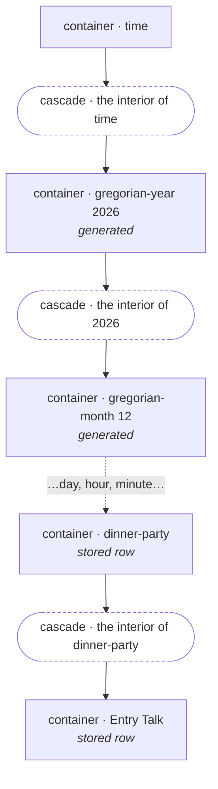
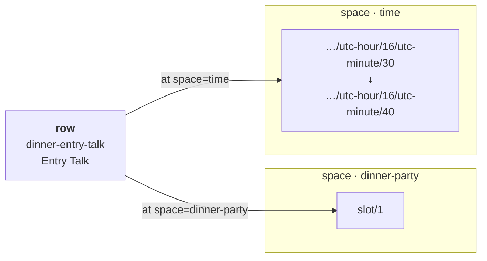
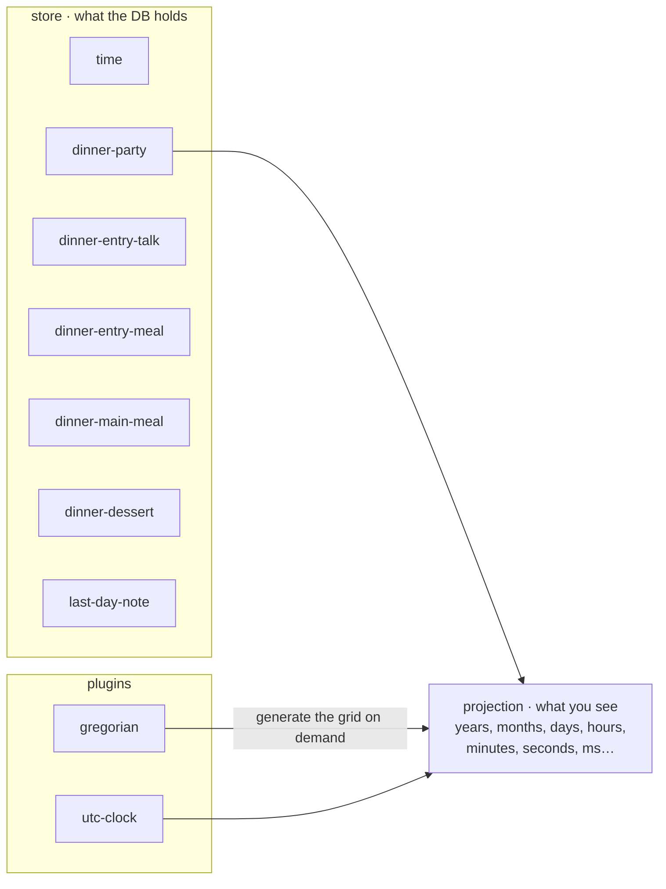
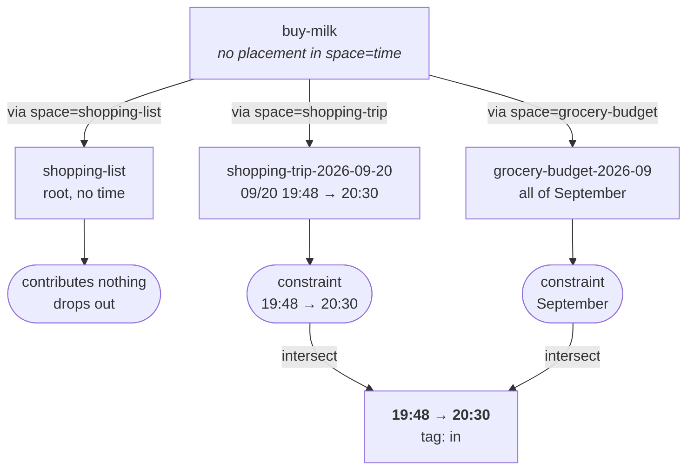
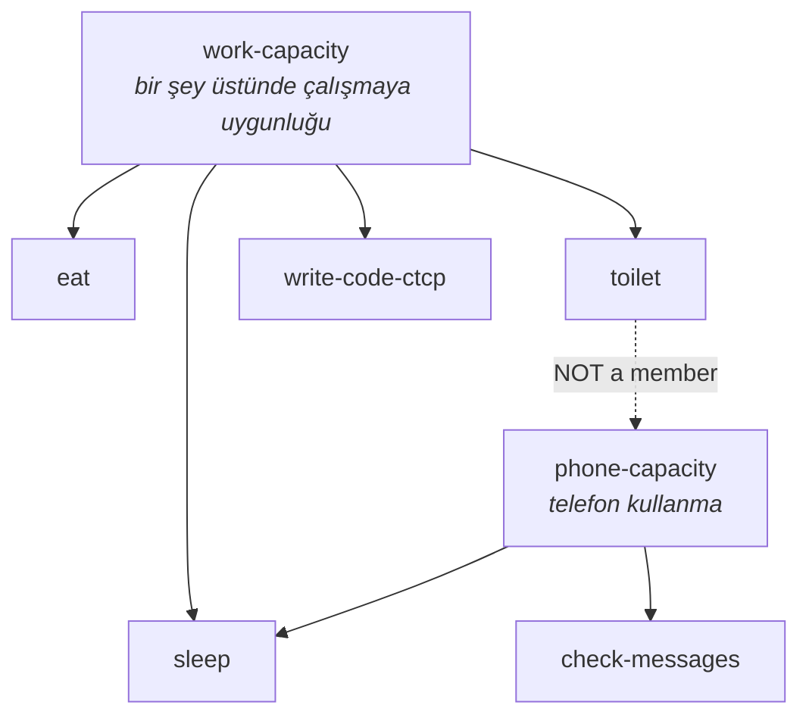
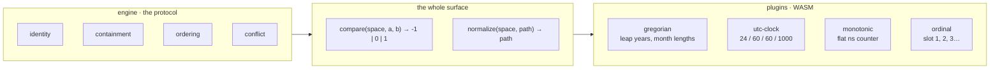
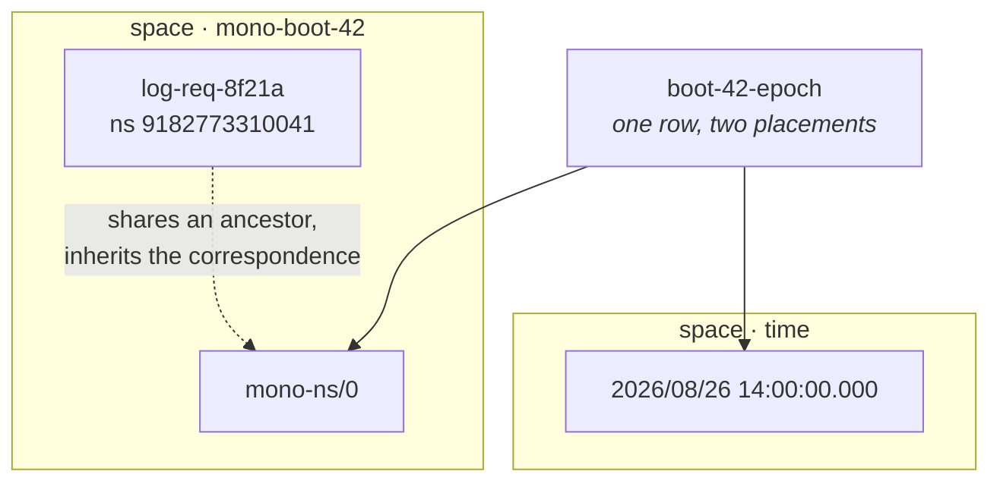

# `ai-*` — the model, drawn

Mermaid source. Renders as SVG on GitHub, in Obsidian, and in any Neovim
previewer. Readable as plain text without one.

Each diagram names the file it comes from.

---

## 1 · The recursion

Containers do not contain containers. They contain a **cascade**, and the
cascade contains containers. The tree strictly alternates.

A cascade has no id of its own — it is named by the container that owns it.
That is why `SpaceID = ContainerID`.



Year and dinner party are the same kind of thing. Time is not privileged —
it is one container whose plugin generates an unbounded interior.

---

## 2 · One row, many spaces

`ai-example.xml`. The load-bearing diagram.

One stored row holds one placement per space. The positions are independent:
Entry Talk is *always* course 1, whatever time it starts.



Rendered into a tree, that one row appears **three** times — once as course 1,
once as a `point="start"` marker at 16:30, once as `point="end"` at 16:40.
A tree cannot hold an interval, only points. The row can.

---

## 3 · Store versus projection

`ai-example.xml`. Seven rows produce a calendar with no end.



Not one row for 2026. `gregorian-year` is a single row that *makes* 2026 when
asked. The whole year costs nothing until someone looks at it.

---

## 4 · Resolution — "süt almıştım, ne zaman aldım?"

`ai-inheritance.xml`. Milk has three parents and no time of its own.

Walk up **every** chain. Chains that reach the space you asked for contribute
a constraint; chains that don't drop out silently. Intersect what landed.



Ten parents is not ambiguity — it is ten chances to narrow. No overlap at all
gives `tag: conflict`, which for org logs is the misplaced-entry detector.
Never silently pick a winner.

---

## 5 · Exclusion is containment

`ai-capacity.xml`. No conflict edges, no resource declarations, no new concept.

One missing membership produces the whole toilet/phone rule.



`toilet` is in `work-capacity` and not in `phone-capacity`. That single absence
is why you cannot code on the toilet but can read messages. Conflict = two
occupants of one cascade wanting overlapping time.

---

## 6 · The plugin boundary

The engine stops knowing what a slot means. It needs exactly two functions.



Behind the wall: leap years, labels, locale, `her 2 yılda bir`. In front of it:
nothing that knows what a year is. Both functions sync, so WASM works.

---

## 7 · Depth is precision

`ai-scales.xml`. Every path is an interval; where it stops decides how wide.
No precision field, no granularity field, no unit field.

```
                        the interval each path denotes

gregorian-century/14    ├──────────────────────────────────────────────┤   100 years
 …/gregorian-year/1347     ├────────────────────────────────────┤             1 year
  …/gregorian-month/09        ├──────────────────────────┤                   ~30 days
   …/gregorian-day/20            ├──────────────────┤                           1 day
    …/utc-hour/19                   ├──────────┤                               1 hour
     …/utc-minute/48                   ├────┤                                    60 s
      …/utc-second/00                   ├──┤                                      1 s
       …/utc-ms/000                      ├┤                                        1 ms

each level nests strictly inside the one above it.
stop early and you have said something true but coarse.


start / end add an EXPLICIT span on top of that implicit width:

  start = gregorian-year/1347
  end   = gregorian-year/1351     ├────────── 5 years ──────────┤
```

Two mechanisms, both needed. Depth gives implicit width; `start`/`end` gives
explicit span. The Black Death and a 4-microsecond HTTP request are the same
kind of statement.

---

## 8 · Bridging spaces

`ai-scales.xml`. Not a conversion table — a **container placed in both spaces**.



Bridges are data. A plugin wanting a dense bridge ships containers. The same
mechanism relates `time` to `roman-consular-year`, to a geological epoch space,
to "reign of X". No calendar maths in the core, ever.
